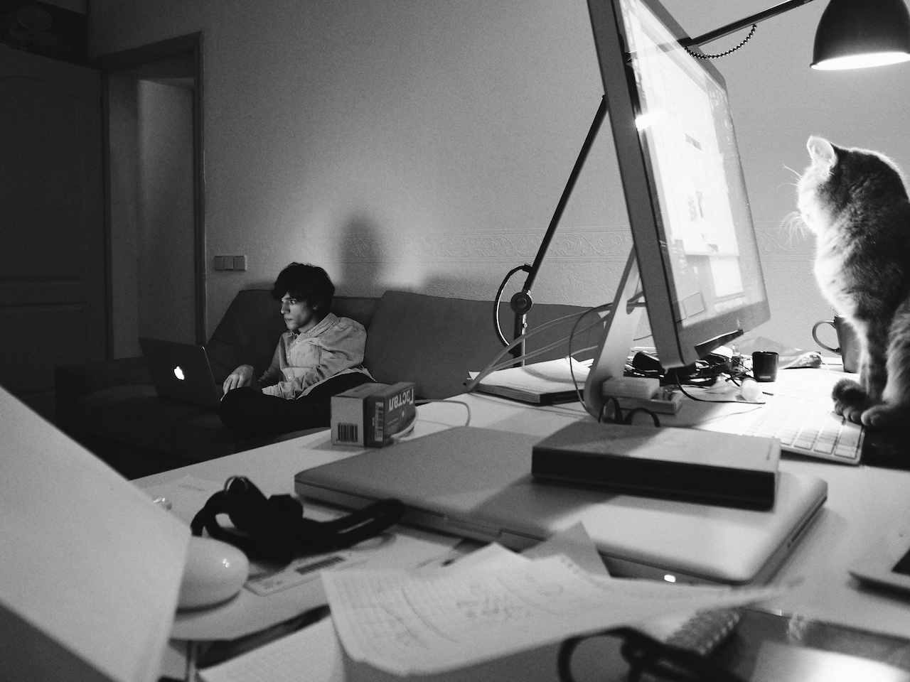
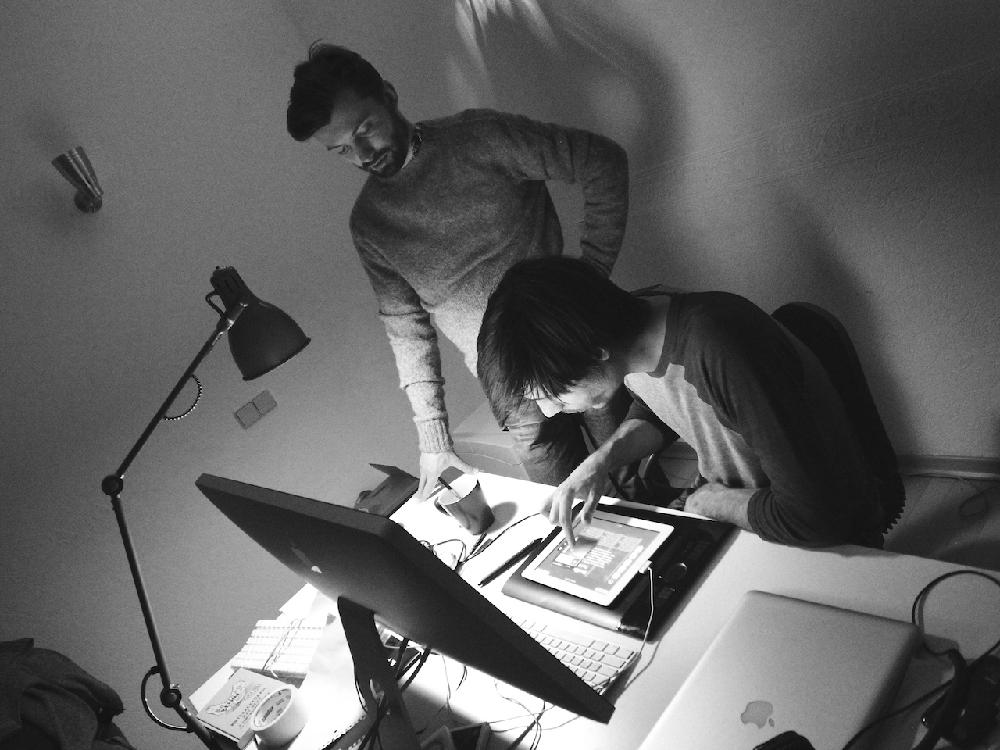

Stampsy is a social platform for sharing and discovering visual stories.

I worked with the team during 2012&ndash;2014 and it was the first start-up
company I joined full-time after doing mostly freelance work.

  <figure>
    
    {/*  */}
    <figcaption>Dan and Varya</figcaption>
  </figure>
  <figure>
    
    {/*  */}
    <figcaption>Roman and Sergey</figcaption>
  </figure>

## Stampsy Web

My work ranged from full-cycle product and user interface design to front-end
engineering and CSS styling.

Together with the team, I've planned the initial scope of the product and its
features, designed the web application and prototyped a lot of the Stampsy
Editor interactions in Framer.js (when it was just a small open-source library).

Later on I moved to building a responsive CSS architecture for the app and
helped the front-end team by transforming the design system into reusable and
styled React components.

!!! abstract External links

- [Stampsy](https://stampsy.com)
- [Story on TNW](https://thenextweb.com/news/stampsy-a-creative-medium-between-a-blog-and-a-website)

!!!

<figure class="full-bleed">
  <video controls autoplay>
    <source src="/img/stampsy/stampsy-web.mp4" />
  </video>
  <figcaption>Promo video featuring parts of my user interface work</figcaption>
</figure>

<figure class="full-bleed">
  <video controls>
    <source src="/img/stampsy/stampsy-site.mp4" />
  </video>
  <figcaption>Marketing website I designed in 2014</figcaption>
</figure>

  <figure>
    
    <figcaption>Feed view</figcaption>
  </figure>
  <figure>
    
    <figcaption>Story page</figcaption>
  </figure>
  <figure>
    
    <figcaption>User-curated collection page</figcaption>
  </figure>
  <figure>
    
    <figcaption>Visual editor for creating stories</figcaption>
  </figure>

## Stampsy iPad app

In 2012, before becoming a web platform, Stampsy was an experimental iPad app
for creating stories with a simple design editor. I designed and prototyped a
lot of its touch-based interactions with different tools and codez.

!!! abstract External links

- [Venturebeat](https://venturebeat.com/media/stampsy-builds-tools-for-the-next-generation-of-bloggers-and-publishers/)

!!!

<figure class="full-bleed">
  <video controls autoplay loop="true">
    <source src="/img/stampsy/stampsy-ipad.mp4" />
  </video>
  <figcaption>Creating and sharing a story in Stampsy iPad app</figcaption>
</figure>
