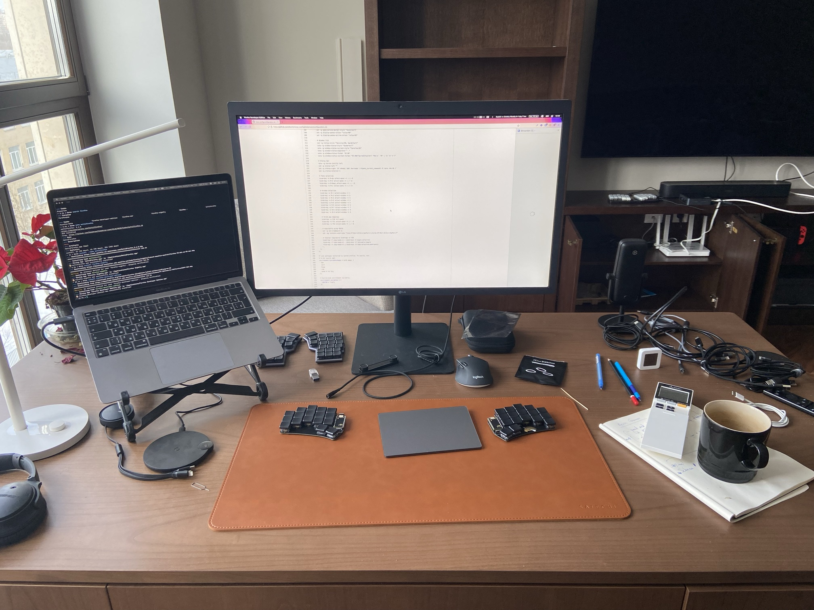

One of my favorite websites is [usesthis.com](https://usesthis.com/). I always
liked reading about the tools people use to get through their day to day.

This page outlines a few details around my own setup.

I don't have a carefully arranged photo of my desk, so here's a snapshot of my
messy workspace in the middle of some work:

## Hardware

- Lenovo X1 Carbon Gen 9
- Custom PC with Ryzen 3600 cpu
- MacBook Air M1
- iPad Pro 11
- Logitech MX Ergo trackball mouse
- Apple Magic Trackpad
- [Corne-ish Zen][corneish] keyboard
- [Ferris Sweep][sweep] keyboard

[corneish]: https://lowprokb.ca/products/corne-ish-zen-2
[sweep]: https://github.com/davidphilipbarr/Sweep

#### Note on keyboards

I’m experimenting with keyboards and layouts a lot lately.

I’ve had a bunch of various keyboards over the last couple years, but I prefer
the low-profile Choc switches by Kailh (the Purpz version).

My layout config has been slimming down in size since I started experimenting.
At the moment I’m using a 34 keys layout (an it actually works well).

Current layout configuration lives [here](https://github.com/kkga/zmk-config).

## Software

I use macOS for work, while Linux is my preferred OS for personal computering
needs. Even though I’ve been a macOS user for 15+ years, I like Linux more these
days.

My Linux setup is barebones: I don’t use a full-fledged desktop environment. A
tiling window manager, a fast terminal and a browser — that’s all I need.

I do all text editing and coding in Kakoune, which is a terminal-based text
editor and my favorite piece of software.

<figure class="full-bleed">
  
  <figcaption>Some terminal windows running in Sway on my laptop</figcaption>
</figure>

Here's a list of essential pieces:

#### Terminal

- Fish (shell)
- Kakoune (text editor)
- [kks](projects/kks.md) -- a small Kakoune companion I wrote

#### Linux

Looks like Firefox is the only "GUI program" that I use here. I spend most of my
time in the terminal.

- Arch Linux on laptop
- Void Linux on desktop
- Sway (window manager)
- Firefox
- Foot (terminal)
- [Syncthing](https://syncthing.net/) -- private, reliable and open-source file
  sync

#### macOS

macOS setup is, naturally, more GUI-centric.

- [Firefox](https://www.mozilla.org/en-US/firefox/new/) -- good web browser
- [Figma](https://figma.com/) -- UI design tool
- [iTerm2](https://iterm2.com/) -- terminal
- [Rectangle](https://github.com/rxhanson/Rectangle) -- simple window management
- [Itsycal](https://www.mowglii.com/itsycal/) -- tiny menubar calendar with Vim
  keybindings and Zoom join buttons
- [Maccy](https://maccy.app/) -- lightweight clipboard manager
- [Syncthing](https://syncthing.net/) -- macOS has a simple menu bar app
- [Bumpr](https://www.getbumpr.com) -- a simple utility to control where links
  open
- [Shottr](https://shottr.cc/) -- small and fast screenshot tool
- [Spaceman](https://github.com/Jaysce/Spaceman) -- view Spaces in the menu bar
- [AltTab](https://github.com/lwouis/alt-tab-macos) -- Windows-style window
  switcher
- [MonitorControl](https://github.com/MonitorControl/MonitorControl) -- makes
  controlling displays more reliable
- [Claquette](https://www.peakstep.com/claquette/) -- good screen recorder

Current desktop configuration lives in a
[GitHub repo](https://github.com/kkga/config).
